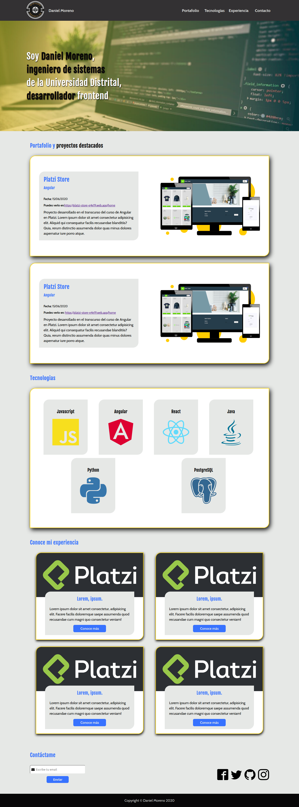

# PERSONAL PORTFOLIO

This repository stores a sketch of my personal portfolio, created from HTML and CSS, during the development of the Online Web Development and Responsive Design course.

## PREVIEW

This is a preview of the project in desktop view:

This is a preview of the project in the mobile view:

You can see the site [here](https://danielfmc.github.io/PortafolioWeb/).
